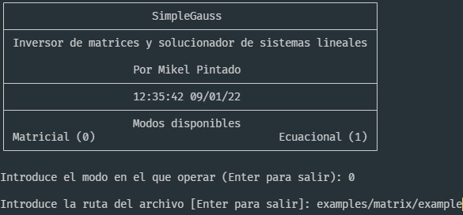
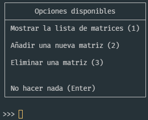
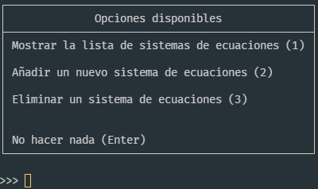
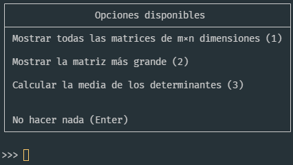
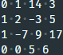
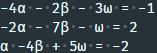
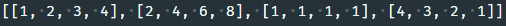
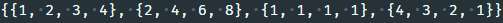
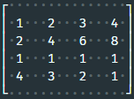
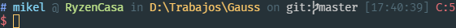

# Proyecto dual de Álgebra y Programación I / Dual project for Algebra and Programming 1

## Por Mikel Pintado del Campo / by Mikel Pintado del Campo

---

**This repository is a read-only copy of my project for the Programming 1 subject of the first semester of the first year of my Computer Science degree at the University of Deusto.**

**Note that it will all be in Spanish from here onwards as this repository has not been created with working any further on the program in mind.**

---

**Recomiendo abrir este documento con un editor de Markdown o un programa que pueda visualizar archivos Markdown.**

---

**Este documento explica el funcionamiento, la premisa y uso del programa. Para ver cómo funciona el programa desde la perspectiva algebráica y cómo funcionan algunos de los algoritmos, ve al documento [Álgebra.md](Álgebra.md). Además, los comentarios del código proporcionan información más detallada sobre todas las partes del programa.**

---

## Índice

- [Introducción](#introducción)
- [¿Por qué es un proyecto dual?](#por-qué-es-un-proyecto-dual)
- [Sobre los requisitos de Programación I](#sobre-los-requisitos-de-programación-i)
- [Cómo se usa](#cómo-se-usa)
- [Sintáxis](#sintáxis)
  - [Matrices](#matrices)
  - [Sistemas de ecuaciones lineales](#sistemas-de-ecuaciones-lineales)
  - [Representar números](#representar-números)
- [Versiones](#versiones)
  - [Versión estándar o 0](#versión-estándar-o-0)
  - [Versión Prog 0 1](#versión-prog-0-1)
- [Configuración](#configuración)
  - [Opción 'mode'](#opción-mode)
  - [Opción 'path'](#opción-path)
  - [Opción 'random' <sup>M</sup>](#opción-random-supmsup)
  - [Opción 'random.number' <sup>M</sup>](#opción-randomnumber-supmsup)
  - [Opción 'random.rank' <sup>M</sup>](#opción-randomrank-supmsup)
  - [Opción 'style' <sup>M</sup>](#opción-style-supmsup)
  - [Otras opciones <sup>M</sup>](#otras-opciones-supmsup)
- [Errores del programa](#errores-del-programa)
- [Compatibilidad](#compatibilidad)

## Introducción

Este programa es tanto un inversor (y analizador) de matrices como un solucionador de sistemas de ecuaciones lineales programado en Python.

Lo he llamado SimpleGauss símplemente el nombre "Inversor de matrices y solucionador de sistemas de ecuaciones lineales" no es que me parezca el mejor del mundo y porque su funcionamiento es muy simple y gira en torno al algoritmo de Gauss.

Tiene dos versiones que establecen cómo opera el programa de cara al usuario y dos modos que establecen el tipo de parámetros que se van a tratar:

- [Versiones](#versiones):
  - [Versión estándar o 0](#versión-estándar-o-0)
  - [Versión Prog o 1](#versión-prog-o-1)

- Modos:
  - Modo matricial o 0
  - Modo ecuacional o 1

## ¿Por qué es un proyecto dual?

He decidido convertir este programa en mi proyecto tanto de Álgebra como de Programación I ya que estaba trabajando en él (llevaba ~500 líneas) antes de que se nos asignara el siguiente trabajo de Álgebra:

```text
Trabajo de Orientación al Aprendizaje (Interrelación Álgebra-Programación)

Después de estudiar detenidamente las competencias sobre estructuras algebraicas y sobre 
matrices, determinantes y sistemas de ecuaciones, intenta dar respuesta a los siguientes retos 
de interrelación en el aprendizaje de conceptos de Álgebra con conceptos de Programación, 
desarrollando las ideas de forma razonada y concisa, en forma de programa fuente con su 
respectivo ejecutable.

b. Como mínimo, el trabajo tiene que dar solución a los siguientes retos:
    1. Resolución en forma de programa del Algoritmo de Gauss para el cálculo del rango de 
       una matriz.
    2. Resolución en forma de programa de la versión avanzada del Algoritmo de Gauss para 
       el cálculo de la matriz inversa.
    3. Resolución en forma de programa del Algoritmo Gauss-Jordan para la resolución de 
       sistemas de ecuaciones lineales.

c. Además, opcionalmente, se sugieren los siguientes retos avanzados:
    8. Resolución en forma de programa de un Algoritmo de cálculo del determinante de una 
       matriz.
    9. Resolución en forma de programa recursivo del Algoritmo de cálculo del determinante 
       de una matriz.

Puede utilizarse cualquier lenguaje de programación.
```

Por lo tanto, he decidido matar dos pájaros de un tiro y entregar el proyecto en ambas asignaturas. Así, he podido aprovechar los requisitos del trabajo de Álgebra para dotar de más funciones al programa además de hacer una respuesta más "usable" a los retos propuestos en Álgebra.

## Sobre los requisitos de Programación I

Creo que he cumplido los requisitos del trabajo de Programación I por los siguientes motivos:

1. Tanto las matrices como los sistemas de ecuaciones tienen ambas listas con sus propiedades, las variables [propertyList](Álgebra.md#propiedades-de-las-matrices) y [solutionList](Álgebra.md#propiedades-de-los-sistemas-de-ecuaciones).

2. Todas las matrices y todos los sistemas de ecuaciones que se van a procesar están almacenadas en listas, las variables matrixList y eqSysList.

3. La función del modo matricial de la versión 1 que permite mostrar aquellas matrices regulares sin incógnitas de la lista con el mayor número de elementos.

4. La función del modo matricial de la versión 1 que permite mostrar todas las matrices regulares sin incógnitas de m×n dimensiones.

5. La función del modo matricial de la versión 1 que calcular la media de los determinantes, si es que los hay.

6.  

- Mostrar un menú
  - Menú principal
    <br>
    
    <br>

  - Mostrar, añadir y eliminar entidades
    <br>
    
    
    <br>

  - Llamar a las funciones de los puntos 3, 4 y 5
    <br>
    
    <br>

- Tanto las matrices como los sistemas de ecuaciones se cargan desde ficheros con la extensión .input de los que se habla más adelante.

- Tanto las matrices como los sistemas de ecuaciones se exportan a ficheros con la extensión .output de los que se habla más adelante.

## Cómo se usa

Estos son los pasos necesarios para trabajar con el programa:

1. Tener preparado [un archivo *.input*](#sintáxis) que contenga las matrices o sistemas de ecuaciones a analizar.
   - Cuando se opera en modo matricial no hace falta aportar ningún archivo existente, pero el programa solo operará con la matriz identidad de orden 3 y aquellas que el usuario decida introducir por teclado (en caso de estar usando la versión 1).
2. Modificar la variable *version* que se encuentra al principio del código fuente para usar [la versión que se quiera](#versiones).
3. Ejecutar `python simplegauss.py` en la terminal.
4. Acudir a la carpeta en la que está ubicado el archivo de entrada para ver los resultados en el archivo de salida *.output* generado.

## Sintáxis

---

**Puedes encontrar unos cuantos archivos *.input* de ejemplo en la carpeta *examples*, pero voy a tratar de explicar la sintáxis igualmente en este documento.**

---

Los archivos *.input* son los archivos que usa el programa como archivos de entrada. Realmente no tienen mucho misterio, son archivos de texto plano que contienen matrices o sistemas de ecuaciones separados por líneas en blanco.

### Matrices

Para representar una matriz en un archivo *.input* hay que escribir cada fila en su propia línea. Para separar los elementos de cada fila se usan espacios (da igual el número).

Por ejemplo, la matriz
$$
\begin{bmatrix}
0 & 1 & 14 & 3\\
1 & 2 & -3 & 5\\
0 & -7 & 9 & 17\\
0 & 0 & 5 & 6
\end{bmatrix}
$$

debe ser representada de la siguiente forma en el archivo *.input*:
<br>
<br>
 (los puntos grises son espacios.)

### Sistemas de ecuaciones lineales

Para representar un sistema de ecuaciones en un archivo *.input* hay que hacerlo de un modo muy parecido al que se representan las matrices:
cada ecuación debe ser escrita en su propia línea y para separar los elementos dentro de cada ecuación se usan espacios.

La parte de los coeficientes de incógnitas debe estar separada de la parte de las constantes por un signo de igual y no se admiten parámetros.

Para representar las incógnitas hay que usar números que estén "pegados" a las incógnitas (da igual el orden en el que esté cada uno) y no se puede omitir ninguna en caso de que su coeficiente sea 0.

Además, se pueden incluir signos de suma y resta (separados con espacios ya que no dejan de ser elementos), aunque los símbolos de adición pueden ser omitidos sin que ello afecte al resultado y también se puede incluir la misma incógnita varias veces (4x + 7y + z + y = 4x + 8y + z).

Por ejemplo, el sistema de ecuaciones lineales
$$
\begin{cases}
-4\alpha - 2\beta - 3\omega = -1 \\
-2\alpha - 7\beta - \omega = 2 \\
\alpha - 4\beta + 5\omega = -2 \\
\end{cases}
$$

debe ser representado de la siguiente forma en el archivo *.input*:
<br>
<br>
 (los puntos grises son espacios.)

### Representar números

El programa admite cierta flexibilidad a la hora de representar los números, que pueden ser representados usando una sintáxis "pseudomatemática".
Como no se admite el uso de paréntesis, se establece el siguiente orden de preferencia:

1. Multiplicaciones (*)
2. Potencias (^)
3. Divisiones (/)

No se admiten sumas ni restas entre números dentro de un mismo elemento, ya que los signos de suma y resta están reservados para alterar el signo del número.

Un ejemplo de expresión representada usando esta sintáxis es --2^2^2\*4/5\*2^0.5, que equivaldría a escribir -$\Big(-\frac{{(2^2)}^{({2}\cdot{4})}}{sqrt{({5}\cdot{2})}}\Big)$ $\approx$ 20724.302873679.

He creado esta sintáxis para representar números como $\frac{\sqrt{2}}{2}$, $\frac{1}{3}$ o ${10}^{12}$.

Hay que tener en cuenta que los números se redondean a 6 decimales por defecto en el archivo de salida, pero puede modificarse el número de decimales al que se redondean los números cambiando la variable *decimals* en la función *prettifyMatrixElements* (línea 2314).

También puede modificarse la sensibilidad del programa a la hora de transformar números muy pequeños a 0 cuando se restan filas modificando el valor de la variable *numberToZero* en la función *substractRows* (línea 1041).

## Versiones

### Versión estándar o 0

La versión estándar del programa o versión 0 es la que recomiendo usar ya que es la versión más completa en cuanto a características y la que yo creo que es más cómoda de usar debido a su simpleza.

Esta versión no consta de ningún menú que guíe al usuario en la ejecución del programa.

A cambio de perder esa faceta más "user-friendly", la versión 0 proporciona al usuario más control sobre el funcionamiento del programa ya que le permite configurar el programa haciendo pleno uso de [las 12 opciones disponibles](#configuración).

Una cosa que considero buena de esta versión es que al no mostrar ninguna interfaz y operar de forma automática, puede llegar a automatizarse con shell scripts o scripts de PowerShell que pueden extender la funcionalidad del programa pasando archivos de entrada además de aprovechar los diferentes códigos de error del programa para operar de una forma u otra.

Para operar con esta versión solo hace falta:

- Establecer el valor de la variable version que está al principio del código en 0.
- Modificar el diccionario *config* que se encuentra al principio del código fuente para aplicar la [configuración](#configuración) deseada.
- Ejecutar el siguiente comando en la línea de comandos:
  
  > python simplegauss.py

### Versión Prog 0 1

La versión Prog o versión 1, cuyo nombre es literalmente una abreviatura de Programación I, es una versión del programa creada específicamente para satisfacer los requisitos del proyecto de gestión avanzada de datos de la asignatura Programación I.

Esta version es una versión mas "user-friendly" del programa que sacrifica un mayor control del programa por una interfaz que guía al usuario durante el proceso. En vez de permitir al usuario operar con [las 12 opciones del programa](#configuración), solo le pregunta por el modo en el que quiere operar y la ruta del archivo en el que se encuentran los elementos (matrices o sistemas de ecuaciones lineales) que analizar.

Sin embargo, esta versión también brinda al usuario la oportunidad de interactuar con la lista de elementos que van a ser enviados al programa antes de operar con ellos. De hecho, el usuario no hacer nada o hacer lo siguiente:

- Mostrar la lista de elementos.
  - Abre una vista en la que se muestran al usuario las matrices o sistemas lineales que ha introducido en un formato legible.

- Añadir un nuevo elemento a la lista.
  - Permite al usuario introducir mediante inputs un nuevo elemento a analizar a la lista.
    - En el caso de las matrices se pide al usuario que introduzca filas por teclado hasta introducir una fila vacía.
    - En el caso de los sistemas de ecuaciones se pide al usuario introducir ecuaciones hasta que introduzca una ecuación vacía.

- Eliminar un elemento.
  - Siempre que haya más de un elemento en la lista, se pide al usuario introducir el número del elemento de la lista a eliminar. Si el usuario introduce 0, no se elimina ningún elemento. Si se introduce algo que no sea un número entero mayor o igual que uno y menor o igual que el número de elementos de la lista, se le pregunta otra vez.

Si el usuario está operando en modo matricial, una vez exportadas las matrices al archivo especificado se le da a elegir entre las siguientes opciones:

- Mostrar todas las matrices de m×n dimensiones.
  - El usuario introduce el número de filas y el número de columnas de las matrices que desea encontrar entre las introducidas y el programa le muestra cuales de ellas tienen esas dimensiones, si es que hay alguna.

- Mostrar la matriz más grande.
  - Muestra aquellas matrices que tengan un mayor número de elementos, es decir, aquellas cuyo producto de filas y columnas sea más grande.

- Calcular la media de los determinantes.
  - Calcula la media de los determinantes de las matrices introducidas, siempre que haya alguna matriz cuadrada sin incógnitas.

Ambos menús se mostrarán al usuario de forma indefinida hasta que este decida no hacer nada más, es decir, hasta que se pulse Enter.

Para operar con esta versión solo hace falta:

- Establecer el valor de la variable version que está al principio del código en 1.
- Ejecutar el siguiente comando en la línea de comandos:
  
  > python simplegauss.py
- Responder a las preguntas que se vayan haciendo con respuestas válidas.

## Configuración

El programa tiene 12 opciones disponibles. Aquellas marcadas con una <sup>M</sup> son exclusivas del modo matricial.

La versión 0 se configura modificando el diccionario 'config' que está al principio del código fuente del programa.
Se pueden crear todo tipo de configuraciones con las 12 opciones, incluso no definir algunas o ninguna.

Esta es una configuración de ejemplo para operar con el archivo de ejemplo de las matrices:

```python
config = {
    'mode': 0,
    'path': 'examples/matrix/example',
    'random': 0,
    'random.number' : 1,
    'random.rank': 10,
    'style': 'default',
    'rank': 1,
    'dimensions': 1,
    'transpose': 1,
    'determinant': 1,
    'idmatrix': 1,
    'oplist': 1
}
```

La versión 1, en cambio, solo permite modificar las dos primeras opciones: las opciones 'mode' y 'path'.
Esto se hace con inputs del usuario.

El programa testea la configuración por si hay alguna opción mal especificada y se sale con [un código de error específico](#errores-del-programa) por cada opción mal definida. Además, se rellenan las opciones no definidas con sus valores por defecto.

### Opción 'mode'

Establece el modo en el que opera el programa.

Puede tomar dos valores, uno por cada modo del programa:

- 0: El programa opera en modo matricial.
- 1: El programa opera en modo ecuacional.

Si no se especifica un valor para la opción mode, su valor será 0. Esto quiere decir que el modo por defecto del programa será el modo matricial.

### Opción 'path'

La ruta del archivo de la que se sacan las matrices y sistemas de ecuaciones lineales.
El archivo de entrada deberá tener la extensión .input y el archivo de salida compartirá nombre y ruta pero
contará con la extensión .output.

Por ejemplo, para que el resultado sea el siguiente:

- Ruta del archivo de entrada: *C:/Users/mikel/Documents/algo.input*
- Ruta del archivo de salida: *C:/Users/mikel/Documents/algo.output*

La opción 'path' deberá ser ajustada de la siguiente forma:
`'path': 'C:/Users/mikel/Documents/algo'`

También funciona con rutas relativas ya que el funcionamiento es el mismo.

Si por algún motivo la opción 'path' no ha sido especificada, el archivo de salida se encontrará en la carpeta del programa
y su nombre será la fecha y hora del día en el que se ha generado. Por ejemplo, si el programa se encuentra en la carpeta
*/home/mikel/Descargas* y son las 11:52:17 pm del 21/02/2022, el archivo de salida será */home/mikel/Descargas/22-02-21_23-52-17.output*.

Si se cumple el caso anterior y la opción 'random' está activada (>0), se operará con la matriz generada.
Si está desactivada (=0 o no definida), en cambio, se operará con la matriz identidad de orden 3 (cuya inversa es la misma matriz identidad de orden 3).

### Opción 'random' <sup>M</sup>

Operar con matrices cuadradas aleatorias en vez de matrices ya incluidas en un archivo.

Esta opción tiene preferencia sobre los archivos de entrada en caso de estar activada.

El comportamiento por defecto de esta opción será estar desactivada, es decir, tener 0 como valor.
Para activarla, hay que introducir un número natural superior a 0 que indique el orden de la matriz cuadrada a generar.

### Opción 'random.number' <sup>M</sup>

Establece el número de matrices cuadradas aleatorias a generar en caso de que la opción 'random' esté activada.

El valor que esta opción tomará por defecto es 1.

### Opción 'random.rank' <sup>M</sup>

Rango de valores con los que las matrices aleatorias serán rellenadas. Estos valores pertenecerán al conjunto de los números enteros
y serán aquellos que se encuentren entre -n y n (incluidos).

El valor por defecto de esta opción es 9, para que se generen matrices aleatorias
cuyos elementos solo tomen como valores los dígitos del sistema decimal y sus análogos negativos.

### Opción 'style' <sup>M</sup>

El estilo al que se exportarán las matrices.

Estilos:

- 1, py, python o plain
  - Exporta la matriz como array bidimensional de Python. Puede ser útil si se quiere introducir las matrices en otro programa similar hecho en Python.
    <br>
    
    <br>

- 2, wa, wolfram
  - Exporta la matriz al formato de Wolfram Mathematica (y Wolfram Alpha). Es útil para comprobar los resultados en el kernel de Wolfram Mathematica.
    <br>
    

- 3, default o human
  - Exporta la matriz a un formato más legible, parecido al de las matrices que pueden verse en un libro de matemáticas.
    <br>
    

Si la opción 'style' no ha sido especificada, el estilo de las matrices generadas será 'default'.

### Otras opciones <sup>M</sup>

Establecen la información sobre la matriz que se mostrará en el archivo de salida.

Estos son parámetros opcionales, ya que el programa siempre mandará la matriz inversa al archivo de salida
Para que un parámetro esté presente, hay que establecerlo su valor en 1. En cambio, para que no esté presente basta
con establecerlo su valor en 0 o no definir la opción correspondiente, pues el comportamiento por defecto de estas opciones es no estar presentes.

Lista de opciones:

- Opción 'rank'
  - Muestra el rango de la matriz introducida.
- Opción 'dimensions'
  - Muestra las dimensiones de la matriz introducida.
- Opción 'transpose'
  - Muestra la matriz transpuesta de la matriz introducida, siempre y cuando esta sea cuadrada.
- Opción 'determinant'
  - Muestra el determinante de la matriz introducida.
- Opción 'idmatrix'
  - Muestra la matriz identidad de orden n asociada a la matriz cuadrada introducida.
- Opción 'oplist'
  - Muestra una lista con las operaciones que se han realizado para invertir la matriz.

## Errores del programa

La siguiente tabla contiene los códigos de error con los que se detiene el programa en caso de que algo salga mal.

|                    Error                    | Código |
|:-------------------------------------------:|:------:|
|               Error de Python               |    1   |
|              Versión no válida              |    2   |
|          Error de la opción 'mode'          |    3   |
|          Error de la opción 'path'          |    4   |
| Falta archivo de entrada en modo ecuacional |    5   |
|         Error de la opción 'random'         |    6   |
|      Error de la opción 'random.number'     |    7   |
|       Error de la opción 'random.rank'      |    8   |
|          Error de la opción 'style'         |    9   |
|          Error de la opción 'rank'          |   10   |
|       Error de la opción 'dimensions'       |   11   |
|        Error de la opción 'transpose'       |   12   |
|       Error de la opción 'determinant'      |   13   |
|        Error de la opción 'idmatrix'        |   14   |
|         Error de la opción 'oplist'         |   15   |
|        Solución de ecuación no válida       |   16   |
|     Sistema de ecuaciones con parámetros    |   17   |

Estos códigos de error son útiles para saber qué es lo que ha ido mal y si el usuario está usando una consola que tenga soporte para mostrar códigos de error
se imprimen en el prompt. Por ejemplo, si se introduce un archivo que no existe en el modo ecuacional el prompt quedaría así:


Además, se pueden aprovechar los códigos de error con shell scripts.

## Compatibilidad

Pese a que Python es un lenguaje multiplataforma, me he asegurado de probar el programa en un mínimo de sistemas operativos ya que usa comandos del sistema para limpiar la pantalla y hace operaciones con el sistema de archivos.

Estos son los sistemas operativos en los que lo he probado con éxito:

- Microsoft Windows
  - Windows 11
  - Windows 10

- GNU/Linux
  - Arch Linux (mediante la box [archlinux/archlinux](https://app.vagrantup.com/archlinux/boxes/archlinux) de Vagrant en VirtualBox)

No lo he probado ni en macOS ni en ningún sistema BSD ya que:

- Ya lo he probado en un sistema tipo Unix (GNU/Linux).
- BSD no lo usa prácticamente nadie en el escritorio.
- No tengo un Mac y no tengo ni tiempo ni ganas de configurar Hackintosh en Ryzen.
